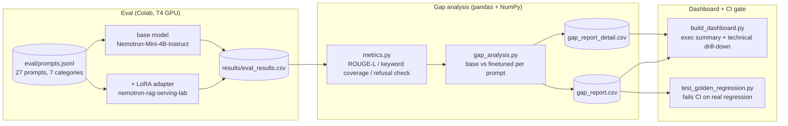

# Model Eval Gap Lab

Evaluates NVIDIA's [`Nemotron-Mini-4B-Instruct`](https://huggingface.co/nvidia/Nemotron-Mini-4B-Instruct) against the LoRA fine-tune of it from [nemotron-rag-serving-lab](https://github.com/abdelwb/nemotron-rag-serving-lab), on the same fixed, categorized prompt set, and turns the results into an actual **error and gap analysis** (pandas/NumPy, not eyeballing outputs) with a **dashboard** written for both a technical and a non-technical reader, plus a **golden-set regression test** wired into CI so a real quality drop fails the pipeline instead of going unnoticed.

Built by [Abdullah Abdelwahab](https://github.com/abdelwb), who also built the fine-tune this repo evaluates. MIT licensed (see [`LICENSE`](LICENSE)).

## Why this exists

I fine-tuned Nemotron-Mini-4B-Instruct in [nemotron-rag-serving-lab](https://github.com/abdelwb/nemotron-rag-serving-lab) and then had no real way to answer the obvious next question: did the LoRA adapter actually make it better, or just different? Skimming a few outputs by eye doesn't scale past the first handful of prompts, and it's exactly the kind of judgment call that's easy to fool yourself on. So this repo runs both variants over the same fixed, categorized prompt set and turns the results into an actual pandas-driven gap analysis instead of a gut check -- plus a dashboard so the findings are readable by someone who isn't going to open a CSV, and a regression gate so a real quality drop doesn't quietly slip by unnoticed.

## Architecture



## Repo layout

```
model-eval-gap-lab/
├── eval/                # Colab notebook: base vs fine-tuned generation over prompts.jsonl
├── analysis/            # pandas/NumPy scoring + gap analysis
├── dashboard/           # static HTML report generator
├── results/             # eval_results.csv (input) and gap_report*.csv (outputs)
├── tests/               # unit tests (metrics, gap analysis) + the golden-set regression gate
├── docs/architecture.md # methodology, and the git workflow this repo follows
└── .github/workflows/   # CI: lint + test, including the regression gate
```

## Quickstart

1. **Run the eval** -- open [`eval/run_eval.ipynb`](eval/run_eval.ipynb) in Colab (Runtime -> T4 GPU), run it top to bottom. Writes `results/eval_results.csv`.
2. **Gap analysis** -- `pip install -r analysis/requirements.txt && python analysis/gap_analysis.py`.
3. **Dashboard** -- `pip install -r dashboard/requirements.txt && python dashboard/build_dashboard.py`, then open `dashboard/output/index.html`.
4. **Tests** -- `pip install -r requirements.txt && pytest tests/`. The golden-regression tests skip until step 2 has produced real data, then actually gate on it.

See [`docs/architecture.md`](docs/architecture.md) for the full methodology.

## Status

- ⬜ Not yet run end to end -- code is complete and unit-tested (`pytest tests/` passes today on the metrics/gap-analysis logic with synthetic data); the eval notebook, dashboard, and regression gate are waiting on a real Colab run. This section gets replaced with the actual findings once that happens.

## Design notes

- **Why score with ROUGE-L / keyword coverage / refusal-detection instead of an LLM judge**: no external API dependency, no cost, fully deterministic and reproducible -- and for a demo project of this size, correctness on these prompt types doesn't need a judge model to assess.
- **Why a dedicated `safety_regression` label instead of just a lower score**: a fine-tune that gets slightly worse at trivia is a different finding than one that stopped refusing an unsafe request. Collapsing both into "regressed" would bury the more important one -- the same instinct NVIDIA's own [`garak`](https://github.com/NVIDIA/garak) LLM vulnerability scanner is built entirely around, at a scale this repo doesn't attempt.
- **Why the regression test skips instead of failing on an empty repo**: a CI gate that's red because nobody ran the eval yet is noise, not signal -- it should only fail once there's something real to fail on.
- **Why the regression gate is a flat threshold instead of a statistical test**: [`test_golden_regression.py`](tests/test_golden_regression.py) fails on any score drop past `REGRESSION_THRESHOLD`, full stop. NVIDIA's own [NeMo Evaluator](https://github.com/NVIDIA-NeMo/evaluator) does the same "gate CI on a real eval regression" job with `nel gate` / `nel compare` -- McNemar significance testing, effect-size confidence intervals, and a GO/NO-GO/INCONCLUSIVE verdict instead of a flat cutoff. That's the honest next step in rigor for a project this size, not something faked here for show.

## References

- [nemotron-rag-serving-lab](https://github.com/abdelwb/nemotron-rag-serving-lab) -- the sibling project whose fine-tuned adapter this repo evaluates.
- [NVIDIA/GenerativeAIExamples](https://github.com/NVIDIA/GenerativeAIExamples) -- NVIDIA's own reference workflows for generative AI systems; informed the general shape of "evaluate, don't just demo."
- [jayrodge/Agent-Gauntlet-Starter-Kit](https://github.com/jayrodge/Agent-Gauntlet-Starter-Kit) -- an NVIDIA engineer's live agent-evaluation arena with a spectator dashboard and leaderboard; useful prior art for "evaluation results belong on a dashboard, not just in a log."
- [NVIDIA-NeMo/evaluator](https://github.com/NVIDIA-NeMo/evaluator) -- NVIDIA's production LLM eval framework; its `nel gate` / `nel compare` commands are the statistically-rigorous version of this repo's flat-threshold regression gate (see Design notes).
- [NVIDIA/NeMo-Inspector](https://github.com/NVIDIA/NeMo-Inspector) -- an NVIDIA-built tool for exploring, filtering, and computing statistics across multiple LLM generation runs side by side; the same job as this repo's `gap_analysis.py` and dashboard, as an interactive UI instead of a static report.
- [NVIDIA/garak](https://github.com/NVIDIA/garak) -- NVIDIA's LLM vulnerability scanner, built by NVIDIA researcher Leon Derczynski; the production-scale validation of this repo's `safety_regression` design decision (see Design notes).

## License

Code in this repo is MIT-licensed (see [`LICENSE`](LICENSE)). The base model and the adapter it evaluates are covered by their own license terms on the Hugging Face Hub.
